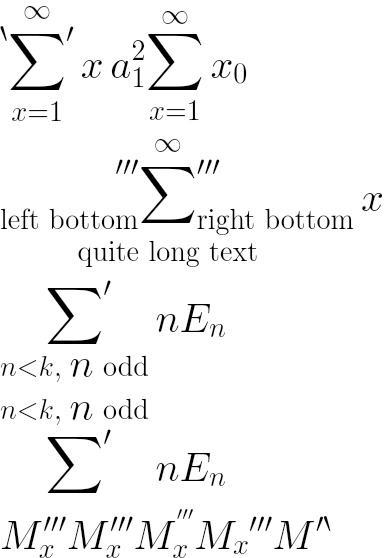

# formula库

## 介绍

formula 主要目的是显示用 LaTeX 编写的数学公式。参考地址：https://github.com/NanoMichael/MicroTeX

## formula

前置条件：NA

场景：

约束：

### 1. Graphic2D

#### 1.1 主要接口

```
public class Graphic2D {
    /*
    * 初始化画布
    *
    * 参数 - render Render
    *
    * 返回值 - Unit
    */
    public init(render: Render)

    /*
    * 获取画布ffi指针
    *
    * 返回值 - CPointer<UInt8>
    */
    public func getG2(): CPointer<UInt8>
    
    /*
    * 画布宽度
    */
    public prop width: UInt32
    
    /*
    * 画布高度
    */
    public prop height: UInt32
}
```

### 2. LaTeX

#### 2.1 主要接口

```
public class LaTeX {
    /*
    * 初始化LaTex
    *
    * 参数 - rootDir 字体资源路径
    *
    * 返回值 - Unit
    */
    public init(rootDir: String)
    
    /*
    * 销毁LaTeX
    *
    * 返回值 - Unit
    */
    public func release(): Unit
    
    /*
    * 解析数学公式
    *
    * 参数 - ltx 数学公式字符串
    * 参数 - width 画布宽度
    * 参数 - textSize 字体大小
    * 参数 - lineSpace 行距
    * 参数 - foreground 前景颜色，ARGB格式
    *
    * 返回值 - Render
    */
    public func parse(ltx: String, width: Int32, textSize: Float32, lineSpace: Float32, foreground: UInt32): Render
}
```

### 3. Render

#### 3.1 主要接口

```
public class Render {
    /*
    * 初始化
    *
    * 参数 - ptr ffi指针
    *
    * 返回值 - Unit
    */
    public init(ptr: CPointer<UInt8>)
    
    /*
    * 绘制图片
    *
    * 参数 - g2 Graphic2D
    * 参数 - x 绘制起始x轴
    * 参数 - y 绘制起始y轴
    *
    * 返回值 - Unit
    */
    public func draw(g2: Graphic2D, x: Int32, y: Int32): Unit

    /*
    * 获取字体大小
    *
    * 返回值 - Int32
    */
    public func getTextSize(): Float32
    
    /*
    * 获取绘制图片高度
    *
    * 返回值 - Int32
    */
    public func getHeight(): UInt32
    
    /*
    * 获取绘制图片宽度
    *
    * 返回值 - Int32
    */
    public func getWidth(): UInt32
    
    /*
    * 销毁Render
    *
    * 返回值 - Unit
    */
    public func finalize(): Unit
        
    /*
    * 生成bitmap图片资源
    *
    * 参数 - g2 Graphic2D
    *
    * 返回值 - Array<UInt8>
    */
    public func toBitmap(g2: Graphic2D): Array<UInt8> 
    
    /*
    * 获取生成图片资源
    *
    * 参数 - g2 Graphic2D
    *
    * 返回值 - Array<UInt8>
    */
    public func getMapData(g2: Graphic2D): Array<UInt8>
}
```

### 示例

test.cj

```
from formula import formula.*
from std import fs.*

main(): Int64 {

    var latex = LaTeX("res")
    var str = ###"
\sideset{^\backprime}{'}\sum_{x=1}^{\infty} x\sideset{a_1^2}{}\sum_{x=1}^\infty x_0
\\
\sideset{_\text{left bottom}'''}{_{\text{right bottom}}'''}\sum_{\text{quite long text}}^\infty x
\\
\sideset{}{'}
\sum_{n<k,\;\text{$n$ odd}} nE_n
\\
\sideset{}{'}
\sum^{n<k,\;\text{$n$ odd}} nE_n
\\
M_x''' M'''_x M^{'''}_x M_x{'''} M^{\prime\backprime}
"###
    var r = latex.parse(str, 2000, 40.0, 10.0, 0)
    var w = r.getWidth()
    var h = r.getHeight()
    var g2 = Graphic2D(w, h)
    r.draw(g2, 0, 0)

    var arr = r.toBitmap(g2)

    var file: File = File("test.bmp", OpenOption.CreateOrTruncate(false))
    file.write(arr)
    file.close()

    return 0
}
```

编译运行：

```
cjc --import-path target/aarch64-linux-ohos/release -Ltarget/aarch64-linux-ohos/release/formula -Llib -lnative_drawing  -llatex -lformula_formula test.cj -o main
```

运行结果如下：



